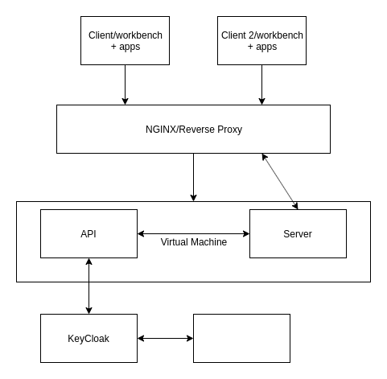

# Deployment to production (Build steps)

## Jenkins steps

1. Setup ENV variables
2. Install node version that is used in project in our case we use now node with code name `erbium`
   which is LTS (Long Time Support) version (12.13.0). - Is it possible in Jenkins e.g. with `.nvmrc`?
3. Install Yarn (package manager) globally
4. Get the git repository and `cd` into `ui` folder
5. run `yarn install` to install node dependencies.
6. run `yarn build:dg3` to build application - which will create `dist` folder inside root `ui`.

## Deploy to server (VM)

1. Copy created `dist` to VM into folder `/opt/dg3/ui`
2. Copy .env file to dist folder and add these env manually into pm2 config (process-prod.json) into env section (should be automatized)
3. Install node - the best is to install actuall LTS `node/erbium`, or maybe this can be specified in ENV
4. Install `pm2` process manager to run node app.
5. Run app with pm2 Example .json config for pm2 is below.

```sh
  pm2 start process-prod.json
```

Questions:

- Do we need run `pm2` in systemd e.g. `pm2 startup systemd` to run
  pm2 when the system is booted or rebooted.

## NGINX as Reverse Proxy

We also need some reverse proxy.
How this will be handled e.g. ports, address a.s.o

## pm2

`pm2` process manager will/can use `process-prod.json` file to manage what will be run.

Example:

```json
{
  "apps": [
    {
      "name": "server",
      "cwd": "/usr/src/dist/server",
      "script": "main.js",
      "watch": false,
      "env": {
        "NODE_ENV": "production"
      }
    }
  ]
}
```

Start pm2

```sh
  pm2 start process-prod.json
```

## Architecture (very simple) diagram


